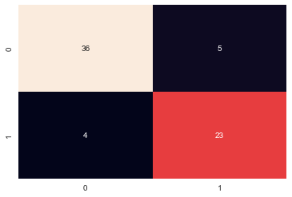

# Prediction of Dementia using Three Ensemble Machine Learning Methods: Project Overview

An application that allows users to predict the risk of a patient having dementia based from their MRI Scan and other medical data

* Three types of Ensemble methods were performed to model the data .i.e Bagging, Stacking and Boosting.
    * Bagging using Random Forest
    * Stacking using Decision Trees, Naive Bayes and K-Nearest Neighbors
    * Boosting using XGBoost

* Performed various Data Preprocessing techniques such as missing data imputation and removal of multicolinear features to clean and make the data ready for model building

* **Tuned hyperparameters** of the model to achieve best performance.

* Boosting had an accuracy of 86.76%, f1-score of 83.64% and recall of 85.19%

* Model was deployed on a web application built using **Django** available at [Dementia Predictor](https://dementia-predictor.herokuapp.com/)
___
## Model Performamce
Accuracy, F1-Score and Recall were the metrics used to evaluate the performance of the model

| Method    |  Accuracy (%)  | F1-Score (%) | Recall (%) |
|-----------|---------|-----------|---------|
| Bagging | 85.29   | 82.14 | 85.19 |
| Stacking | 85.29   | 80.77 | 77.78 |
| **Boosting**   | **86.76**   | **83.64** | **85.19** |

Confusion Matrix
|   | 0  | 1  |
|---|----|----|
| 0 | TN | FP |
| 1 | FN | TP |
___

___
## Model Deployment
The final model with the best score was deployed on a web application built with **Django** with the frontend built with **HTML & CSS** with **Boostrap 4** as the CSS Framework.

___ 
